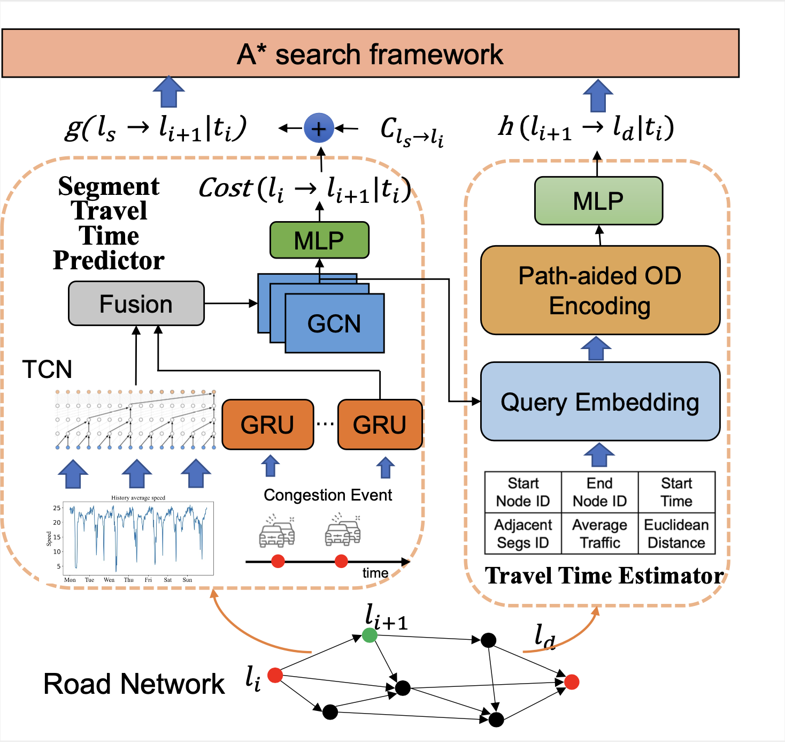

# TKDD2023-CSTGCN-A*

The official PyTorch implementation of "[Congestion-aware Spatio-Temporal Graph Convolutional Network Based A*
Search Algorithm for Fastest Route Search]

The code is tested under a Linux desktop with torch 1.9 and Python 3.8.0.

## Installation

### Environment
- Tested OS: Linux
- Python == 3.8.0
- PyTorch == 1.9

### Dependencies
1. Install PyTorch 1.9 with the correct CUDA version.
2. Use the ``pip install -r requirements.txt`` command to install all of the Python modules and packages used in this project.

### Dataset

Liao B, Zhang J, Wu C, et al. Deep sequence learning with auxiliary information for traffic prediction[C]//Proceedings of the 24th ACM SIGKDD International Conference on Knowledge Discovery & Data Mining. 2018: 537-546.


## Usage

**Step-1** Train Travel Time Prediction model:
```
prediction_train.py
```

**Step-2** Generate H-model dataset:

```
python gen_dataset.py
```

**Step-3** Train H-model:

```
python hmodel_train.py
```

**Step-4** Evaluate :

```
python main.py
```


